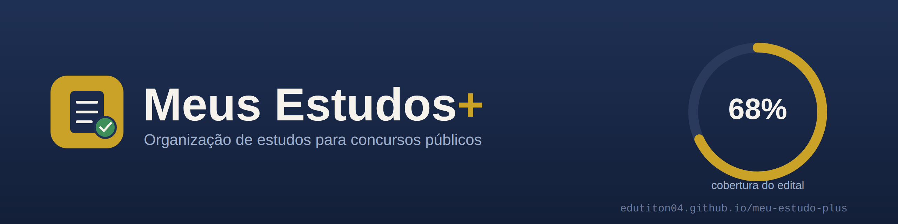
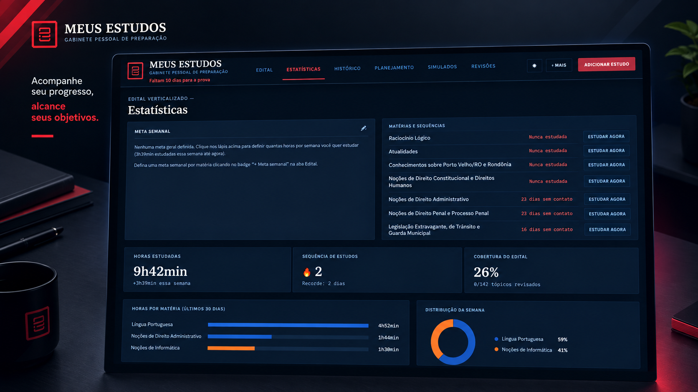

  

# 📚 Meus Estudos+

Plataforma pessoal de organização de estudos para concursos públicos — edital verticalizado, estatísticas, histórico, planejamento semanal, simulados e revisões, tudo em uma única página.

  

  

## 🔗 Acesse aqui

**[https://edutiton04.github.io/meu-estudo-plus/](https://edutiton04.github.io/meu-estudo-plus/)**

## ✨ Funcionalidades

- **Edital verticalizado** com matérias, tópicos, peso e cobertura
- **Central de Prioridades** — sugere onde estudar com base em peso do edital, desempenho, tendência e tempo sem revisar
- **Estatísticas** com gráficos filtráveis por período e matéria
- **Histórico** completo de sessões de estudo
- **Planejamento** semanal (cronograma recorrente) e por ciclo, com geração automática
- **Revisões** com camada própria integrada ao calendário
- **Simulados** e acompanhamento de desempenho
- Modo foco, busca global, notas por tópico, metas semanais e indicador de matérias esquecidas
- Backup, avisos de armazenamento e sincronização entre dispositivos

## 🛠️ Tecnologia

Página única (`index.html`) usando **Firebase Auth/Firestore** para sincronização de conta e **localStorage** como suporte local — sem back-end próprio.

## 📌 Roadmap

- [ ] Motor de repetição espaçada (spaced repetition) com intervalos formalizados
- [ ] Flashcards integrados aos tópicos

---

Projeto pessoal de estudos — construído e mantido por <a href="https://github.com/edutiton04">@edutiton04</a>.

